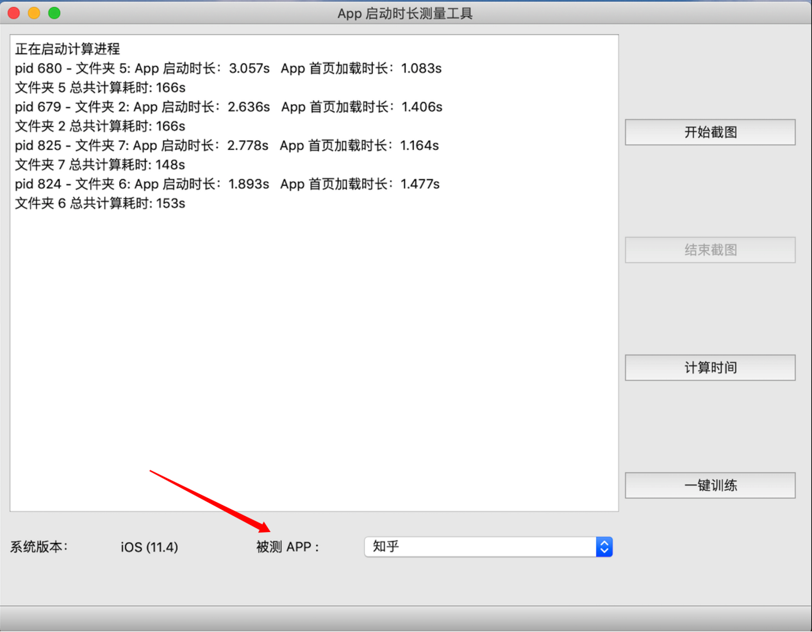
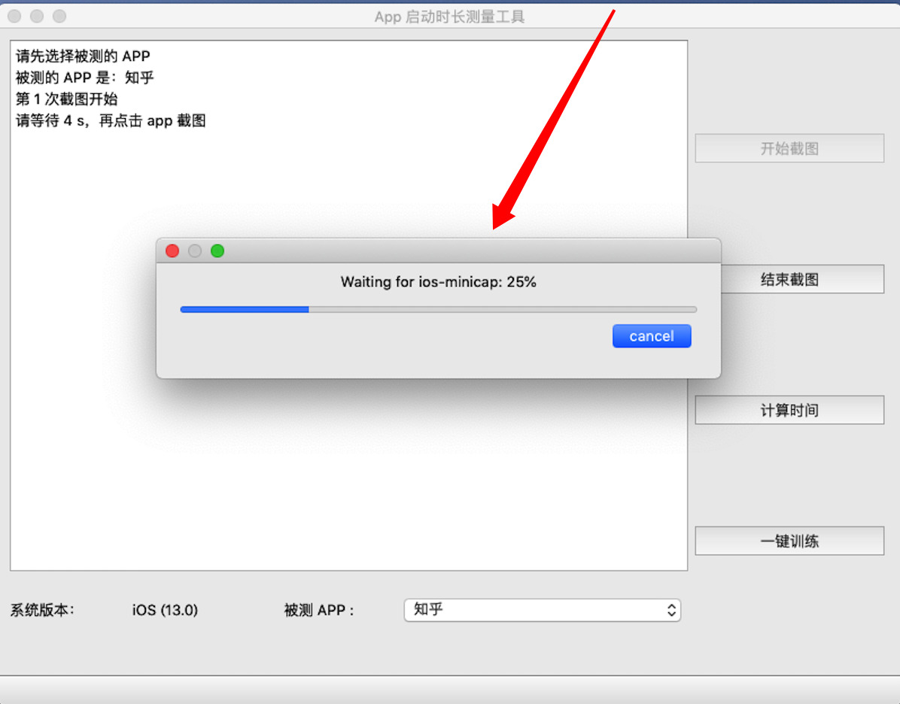
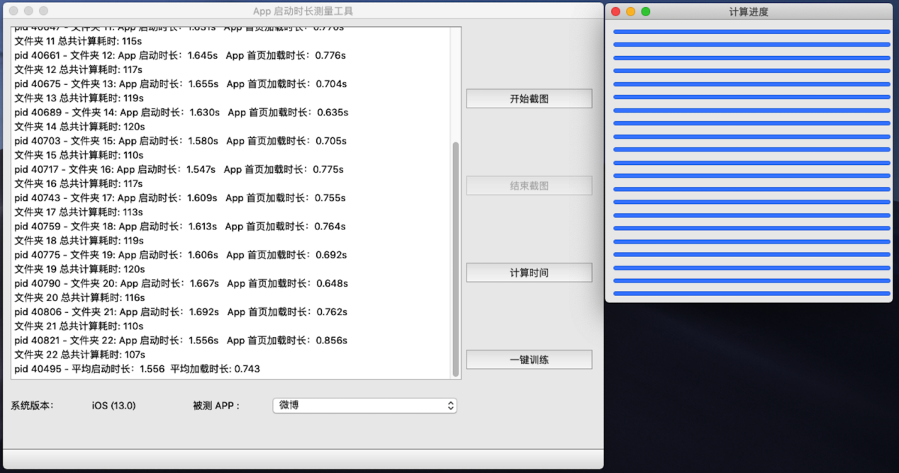
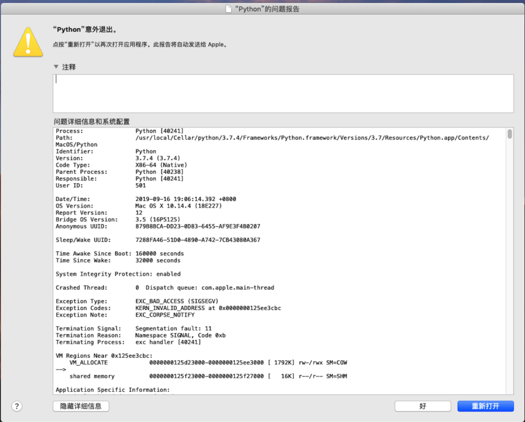

# iOS App 启动时长测量工具
## 环境配置
+ 安装 adb
+ 安装 xcode
+ python 3
+ pip3 install tensorflow==1.13.2
+ pip3 install PyQt5

## 公共步骤
1. 手动安装需要测试的 App（本工具暂时支持「知乎」「头条」「百度」「微博」4种 App）
2. 连接手机，一次只能连接一台手机，否则无法区分
3. 执行 python3 iOSApp.py 启动程序
4. 如下图所示，选择「待测试的 App」

    

## 以下按照不同功能进行说明

## 截图功能
### 操作步骤
1. 点击「开始截图」，然后按照提示等待 4 s，会有进度条显示等待时间（如下图所示）
2. 当进度条结束后，点击手机上的对应 App
3. 当 App 启动完毕后（首页加载完成后），点击「结束截图」
4. 手动杀掉 App（冷启动 App）
5. 再转步骤 1

    

## 注意事项（非常重要）
1. 一定要按照提示，等待进度条结束后，再点击手机上的 App，因为该等待过程包括 iOS minicap 连接初始化过程，如果不等待，会导致「截图不全」或者「坏图（无效图片）」，所以请耐心等待进度条执行完毕。

2. 当 App 启动完毕后，请尽早点击「结束截图」，因为如果不点击「结束截图」，那么程序将不断截图，并发送到计算机，导致整个启动阶段包含很多冗余图片，影响计算性能。

## 时长计算功能
### 前置条件
当截图完毕后，程序所在文件夹中将包含对应的截图序列（当程序所在文件中未包含截图序列时，结果为 0）

### 操作步骤
1. 点击「计算时间」（点击完后，会出现进度条对话框）
2. 当「进度条」都更新完毕后，请关闭「进度条对话框」，所有结果将显示在主程序上，如下图 3 所示。

    

## 注意事项（非常重要）
当点击「计算时间」后，可能会出现「Python crash」的崩溃对话框，如果出现「崩溃对话框」（如下图 4 所示），请按下面步骤进行处理：
1. 关闭「进度条对话框」
2. 再次点击「计算时间」按钮
3. 如果再次出现「python 崩溃对话框」，请直接关闭该「启动时长测量工具」，并重新启动它。

    

