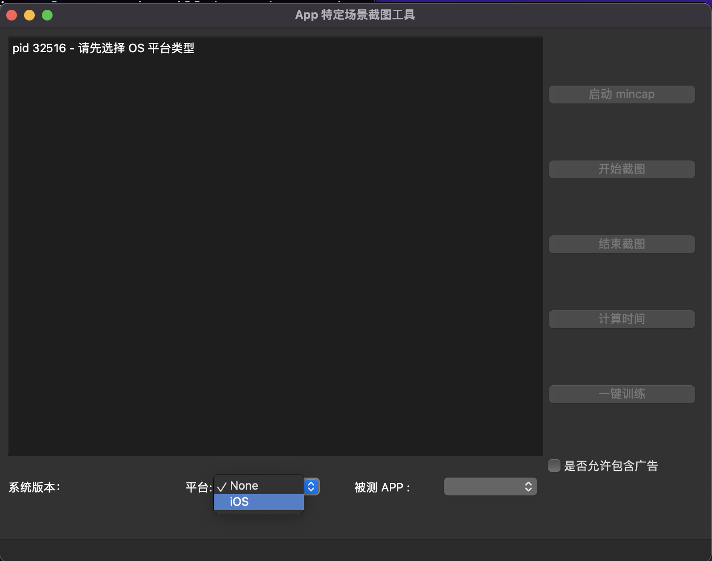
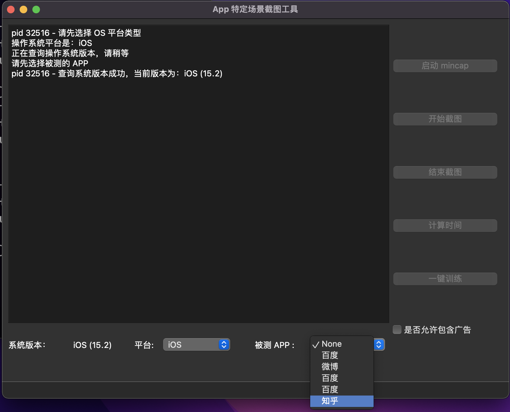
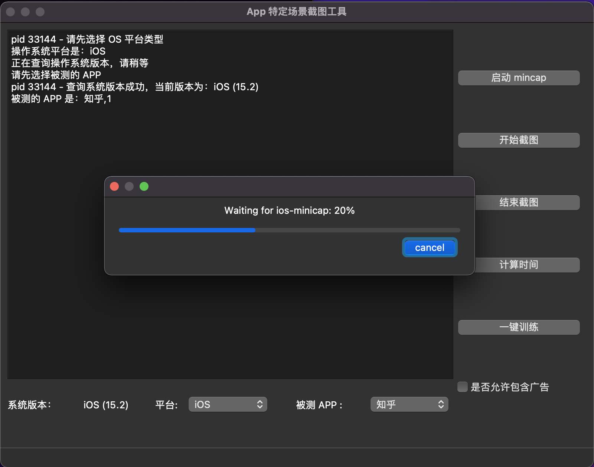
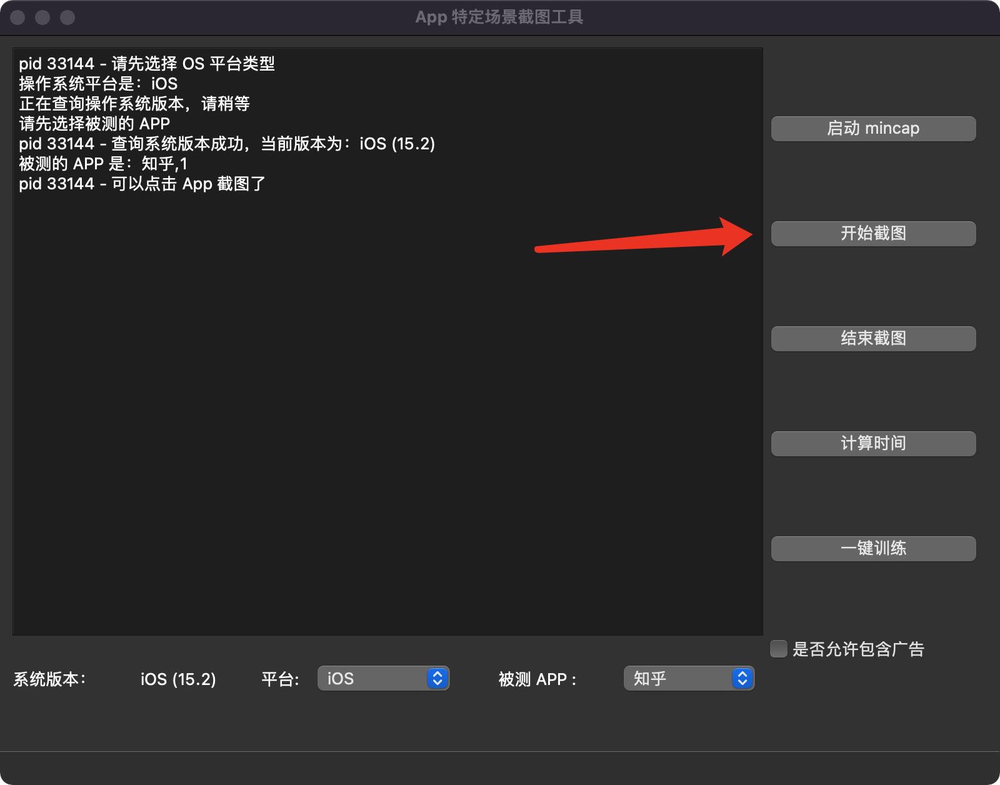
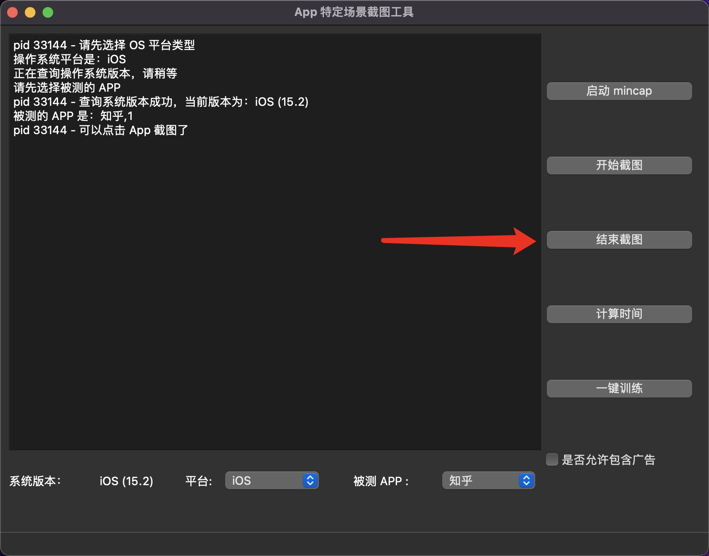
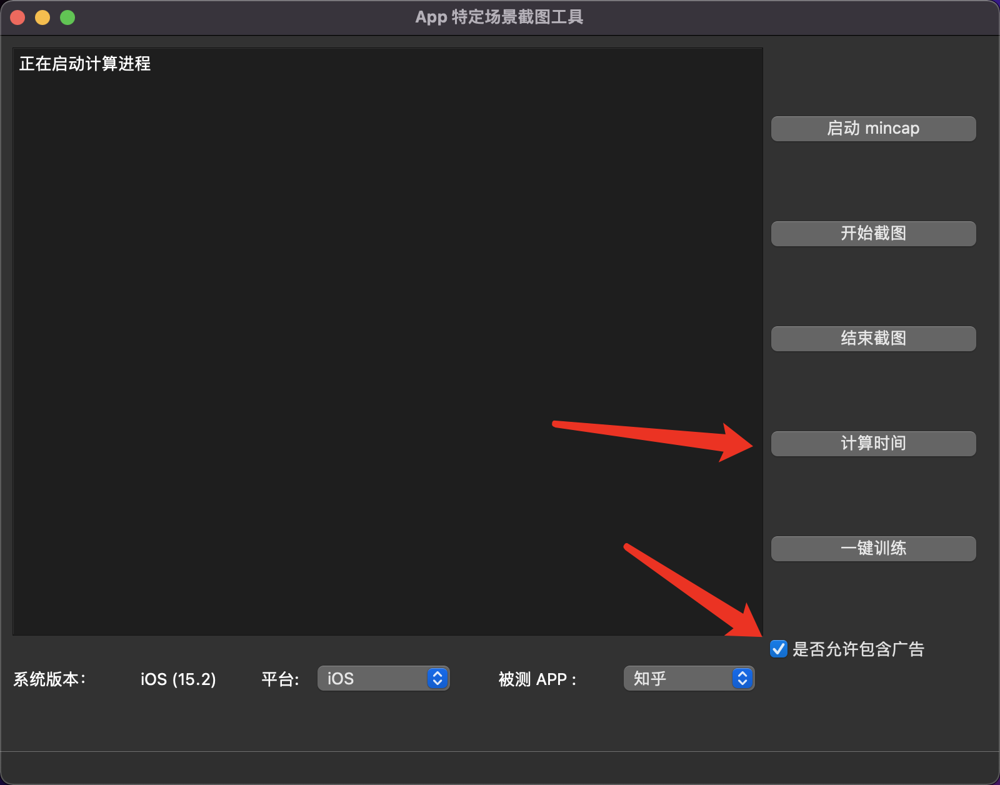
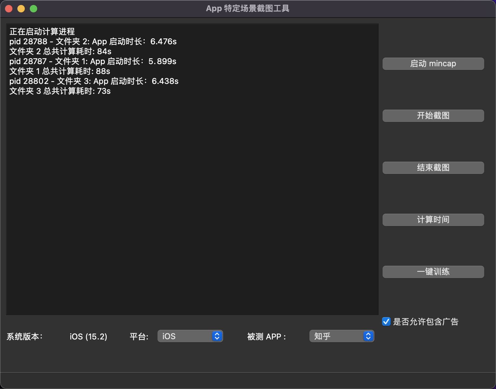
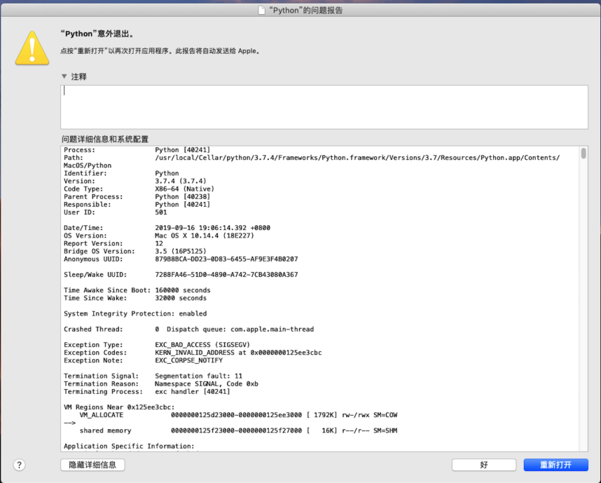

## App 启动时长测量工具

## 环境配置

- 安装 adb
- 安装 xcode
- 安装 python 3.7
- pip3 install tensorflow==1.13.2
- pip3 install PyQt5

## 操作步骤

1. 手动安装需要测试的 App（本工具暂时支持「知乎」「头条」「百度」「微博」4 种 App）
2. 连接手机，一次只能连接一台手机，否则无法区分
3. 执行 python3 iOSApp.py 启动程序
4. 点击最下方「平台」，选择操作系统类型

    

5. 如下图所示，选择「待测试的 App」

    

6. 点击「启动 minicap」，然后等待进度条结束

    

7. 点击「开始截图」，再点击手机上的对应 App

    

8. 当 App 运行到目标界面时，点击「结束截图」

    

9. 截图完毕后，点击「计算时间」，并等待计算结果

    

10. 计算结果中，包含每次打开 app 的启动耗时，以及计算启动时长的程序耗时

    

## 注意事项 1（非常重要）

1. 一定要按照提示，等待进度条结束后，再点击手机上的 App，因为该等待过程包括 iOS minicap 连接初始化过程，如果不等待，会导致「截图不全」或者「坏图（无效图片）」，所以请耐心等待进度条执行完毕。

2. 当 「目标界面」 加载完毕后，请尽早点击「结束截图」，因为如果不点击「结束截图」，那么程序将不断截图，并发送到计算机，导致整个启动阶段包含很多冗余图片。

## 注意事项 2

如果出现「Python crash」的崩溃对话框，如果出现「崩溃对话框」（如下图 4 所示），请按下面步骤进行处理：

- 请直接关闭该「启动时长测量工具」，并重新启动它。（这类崩溃偶现）

    

